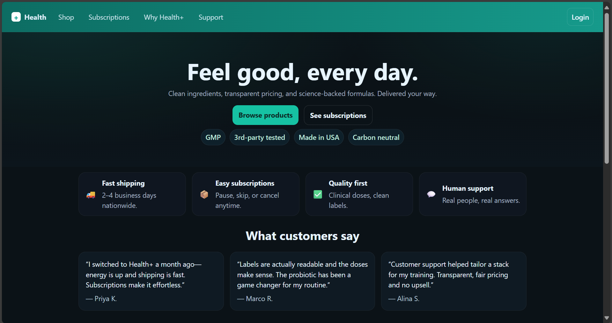
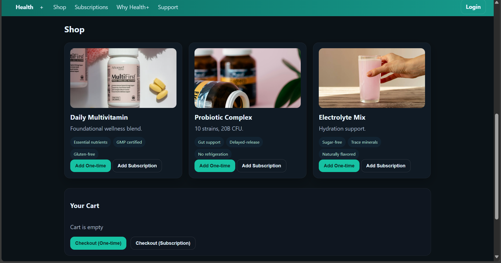
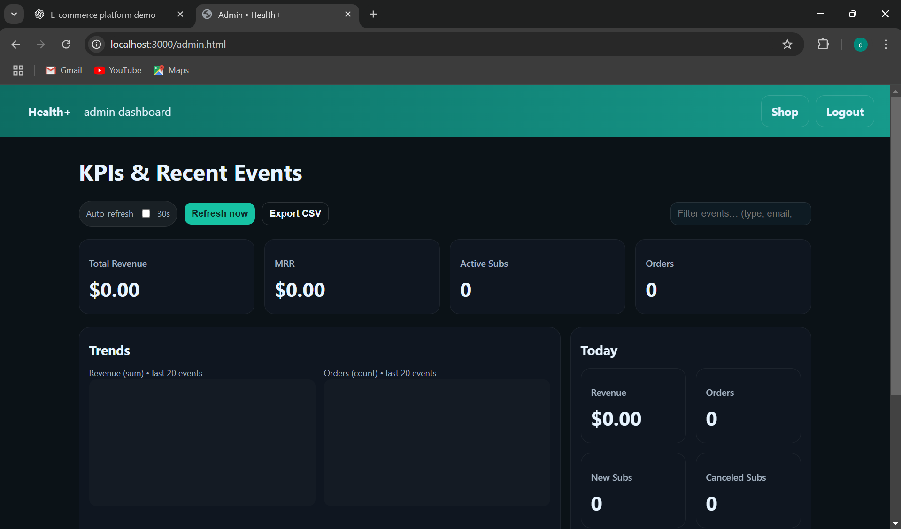
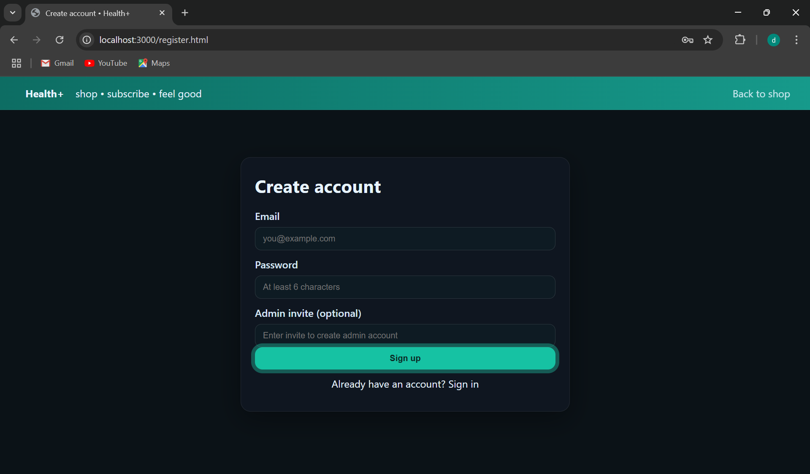
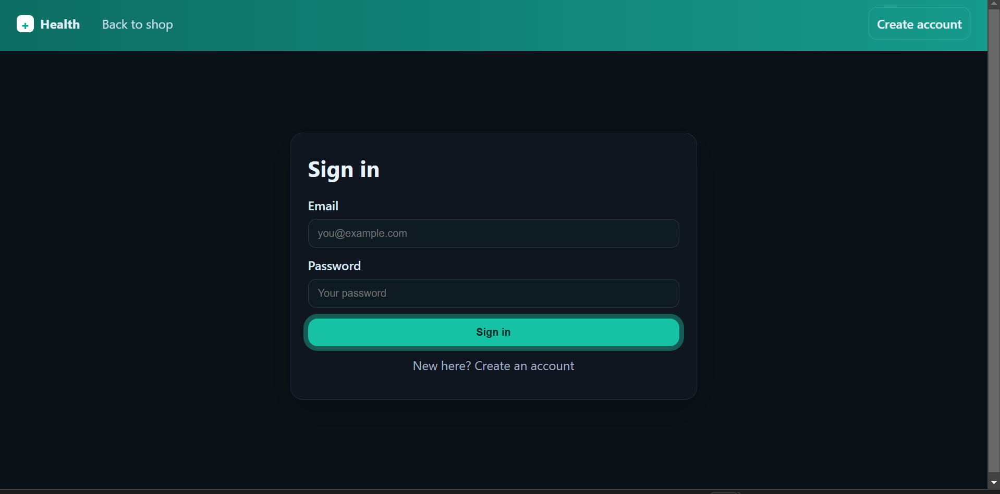

# 🩺 **Health+ E-Commerce Platform**

A sleek **Node.js + Express + HTML/CSS** web app built to showcase a subscription-based wellness storefront — focused on clean UI, modular routing, and seamless client interaction.

---
## 🖼️ Screenshots

| Home Page | Product Section | Cart |
|------------|----------------|-------------|
|  |  |  |

| Admin Dashboard | Signup | Signin |
|-----------------|---------------|-----------------|
|  |  |  |

## 🚀 Overview

**Health+** is a lightweight full-stack demo that merges a beautiful front-end experience with a simple yet functional Express backend.

### ✨ Core Highlights

* 💎 **Responsive UI** with modern Flexbox + CSS Grid
* 🧾 **Dynamic Product Catalog** (JSON-driven data model)
* 💳 **Simulated Checkout Flow** — one-time or recurring
* 🔐 **Mock Authentication** for admin / user roles
* 🧩 **Modular Structure** that’s easy to extend
* 🌈 **Polished Visual Theme** — gradient hero, centered layout

---

## 📂 Project Structure

```
health-plus/
├── data/
│   └── products.json
│
├── public/
│   ├── img/
│   │   ├── vitamins.jpg
│   │   ├── probiotic.jpg
│   │   └── electrolyte.jpg
│   ├── index.html
│   ├── login.html
│   ├── admin.html
│   ├── register.html
│   ├── styles.css
│   ├── auth.js
│   └── client.js
│
├── server.js
├── package.json
├── .gitignore
├── .env.example
└── README.md
```

---

## ⚙️ Installation & Setup

### Prerequisites

* **Node.js v18+**
* **npm** (bundled with Node)
* Modern browser (Chrome / Edge recommended)

### Quick Start

```bash
git clone https://github.com/dhaminideva/health-plus.git
cd health-plus
npm install
node server.js
```

Then open 👉 **[http://localhost:3000](http://localhost:3000)**

---

## 🔑 Default Users

| Role  | Email                                         | Password |
| ----- | --------------------------------------------- | -------- |
| Admin | [admin@example.com](mailto:admin@example.com) | q        |
| User  | [user@example.com](mailto:user@example.com)   | a        |

---

## 🖼️ Key Pages

### 🏠 `index.html`

* Centered hero section with CTAs
* Feature cards (shipping / quality / support)
* Testimonials grid
* Product gallery + mini cart
* Newsletter subscription band

### 🔐 `login.html`

* Form-based mock authentication
* Redirects to dashboard upon login

### ⚙️ `admin.html`

* Role-restricted dashboard (protected via middleware)

---

## 🧠 How It Works

1. **Express** serves all static assets from `/public`.
2. **Sessions** store temporary login state.
3. **/api/products** returns `products.json` data.
4. **Cart & checkout** logic runs client-side (in-memory).

---

## 🛠️ Tech Stack

| Layer    | Technology                   |
| -------- | ---------------------------- |
| Frontend | HTML5, CSS3, Vanilla JS      |
| Backend  | Node.js + Express            |
| Data     | Static JSON                  |
| Auth     | Mock Sessions                |
| Styling  | Custom CSS (Flex + Grid)     |
| Hosting  | Any Node-compatible platform |

---

## 🌟 Highlights

* Fully visible landing flow (no scrolling clutter)
* Optimized for laptops & mobile screens
* Dual-radial + linear gradient backgrounds
* Clear, semantic HTML structure
* Simple to expand — add new products in seconds

---

## 🚧 Future Enhancements

* Add real DB (MongoDB / SQLite)
* JWT-based authentication
* Stripe / Razorpay live checkout
* Admin analytics dashboard
* Deploy to Vercel / Render / AWS

---

## 👩‍💻 Author

**Dhamini Devaraj**
*M.S. Computer Science — UMass Amherst*
Specializing in **Cybersecurity & Full-Stack Engineering**

> *Clean UI • Modular Code • Secure by Design*

---

## 🪪 License

Open for educational and demonstration use.
© 2025 Health+ Demo — All rights reserved.

